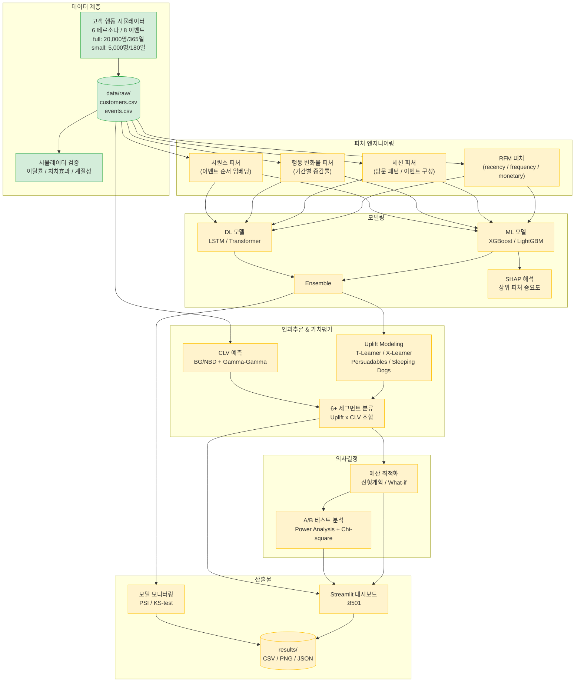

# AI 기반 고객 이탈 예측 및 리텐션 ROI 최적화 시스템

> 이커머스 고객 이탈 예측 + Uplift Modeling 기반 리텐션 ROI 최적화 End-to-End 시스템

[](https://www.python.org/)
[](https://pytorch.org/)
[](https://docs.docker.com/compose/)


## 목차

1. [프로젝트 소개](#프로젝트-소개)
2. [핵심 기능](#핵심-기능)
3. [시스템 아키텍처](#시스템-아키텍처)
4. [기술 스택](#기술-스택)
5. [프로젝트 구조](#프로젝트-구조)
6. [시작하기](#시작하기)
7. [실행 방법](#실행-방법)
8. [환경변수](#환경변수)
9. [데이터 흐름](#데이터-흐름)
10. [산출물 가이드](#산출물-가이드)
11. [팀 정보](#팀-정보)
12. [마일스톤](#마일스톤)

---

## 프로젝트 소개

### 배경

- 신규 고객 획득 비용은 기존 고객 유지 비용의 **5배** 이상
- 이탈률 5% 감소 → 수익 25% 이상 증가 가능
- 단순 이탈 예측을 넘어, **마케팅 효과가 있는 고객을 식별**하고 제한된 예산 내에서 최적 리텐션 전략을 수립하는 것이 핵심

### 목표

End-to-End 리텐션 시스템 구축:

**시뮬레이터 → 피처 엔지니어링 → ML/DL 모델 → Uplift Modeling → CLV 예측 → 예산 최적화 → 통합 대시보드**

### 학습 포인트

- 코호트 분석 / RFM / 행동 변화율 피처 설계
- Uplift Modeling으로 Persuadables / Sleeping Dogs 식별
- CLV × Uplift 기반 마케팅 예산 최적화
- A/B 테스트의 Power Analysis 및 통계적 유의성 검정

---

## 핵심 기능

| 기능 | 상태 | 담당 |
|------|------|------|
| 고객 행동 시뮬레이터 (6 페르소나 / 8 이벤트) | ✅ 완료 | 형준 |
| 시뮬레이터 검증 (이탈률 / 처치 효과 / 계절성) | ✅ 완료 | 형준 |
| 코호트 분석 (M1/M3/M6/M12 + Power-law) | ✅ 완료 | 형준 |
| 환경변수 분리 (python-dotenv) | ✅ 완료 | 형준 |
| Docker Compose 인프라 | ✅ 완료 | 형준 |
| 피처 엔지니어링 (RFM / 세션 / 행동 변화율 / 시퀀스) | 🚧 개발 중 | 현우 |
| ML 이탈 예측 (XGBoost / LightGBM + SHAP) | 🚧 개발 중 | 한솔 |
| DL 시퀀스 모델 (LSTM / Transformer) | 🚧 개발 중 | 한솔 |
| Uplift Modeling (T-Learner / X-Learner, 4분면) | 🚧 개발 중 | 한나 |
| CLV 예측 (BG/NBD + Gamma-Gamma) | 🚧 개발 중 | 한나 |
| 6+ 세그먼트 분류 + 우선순위 | 🚧 개발 중 | 한나 |
| 예산 최적화 (선형계획 / What-if) | 🚧 개발 중 | 한나 |
| A/B 테스트 분석 (Power Analysis + Chi-square) | 🚧 개발 중 | 한나 |
| 통합 대시보드 (Streamlit, :8501) | 🚧 개발 중 | 지웅 |
| 모델 모니터링 (PSI / KS-test) | 🚧 개발 중 | 지웅 |

---

## 시스템 아키텍처



---

## 기술 스택

| 카테고리 | 라이브러리 / 버전 |
|---------|-----------------|
| 언어 | Python 3.10+ |
| 데이터 처리 | pandas 2.2, numpy 1.26 |
| ML | XGBoost 2.0, LightGBM 4.3, scikit-learn 1.5 |
| 클래스 불균형 | imbalanced-learn 0.11 (SMOTE) |
| 하이퍼파라미터 최적화 | Optuna 3.4 |
| DL | PyTorch 2.0+ (CPU wheel) |
| Uplift | 자체 구현 (T-Learner / X-Learner, scikit-learn 기반) |
| CLV | lifetimes 0.11 |
| 모델 해석 | SHAP 0.46 |
| 통계 | SciPy 1.13 |
| 시각화 | matplotlib 3.9, seaborn 0.12, plotly 5.24 |
| 대시보드 | Streamlit 1.40 |
| 컨테이너 | Docker, Docker Compose |
| 환경변수 | python-dotenv 1.0 |

---

## 프로젝트 구조

```text
customer-churn-retention-system/
├── config/
│   ├── simulator_config.yaml      # 시뮬레이터 설정 (페르소나 / 마케팅 / 시즌)
│   └── model_config.yaml          # 모델 하이퍼파라미터 / 경로 / SHAP 설정
├── data/
│   ├── raw/                       # 시뮬레이터 출력 (customers.csv, events.csv)
│   └── processed/                 # 피처 엔지니어링 결과 (feature_store.parquet)
├── src/
│   ├── main.py                    # 진입점 — 4가지 모드 분기
│   ├── main_train.py              # 학습 파이프라인 (standalone)
│   ├── data/
│   │   ├── simulator.py           # 고객 행동 시뮬레이터
│   │   └── validate_simulator.py  # 시뮬레이터 검증
│   ├── analysis/
│   │   └── cohort.py              # 코호트 리텐션 분석
│   ├── features/
│   │   ├── rfm.py                 # RFM 피처
│   │   ├── session.py             # 세션 / 이벤트 피처
│   │   ├── sequence.py            # 시퀀스 피처
│   │   └── store.py               # 피처 스토어 통합
│   ├── models/
│   │   ├── ml_trainer.py          # XGBoost / LightGBM 학습
│   │   ├── shap_analyzer.py       # SHAP 해석
│   │   ├── clv_predictor.py       # CLV (BG/NBD)
│   │   ├── uplift.py              # Uplift 모델
│   │   ├── data_loader.py         # 데이터 로더
│   │   └── config_loader.py       # 설정 로더
│   ├── uplift/
│   │   └── segmentation.py        # 6+ 세그먼트 분류
│   ├── optimization/              # 🚧 예산 최적화
│   ├── monitoring/                # 🚧 PSI / KS-test 모니터링
│   └── dashboard/
│       └── app.py                 # 🚧 Streamlit 대시보드
├── docs/
│   ├── feature_dictionary.md      # 피처 정의서
│   └── uplift_analysis.md         # Uplift 분석 결과
├── results/                       # 분석 산출물 (CSV / PNG)
├── models/                        # 학습된 모델 파일
├── notebooks/
│   └── eda.ipynb                  # 탐색적 데이터 분석
├── tests/                         # 단위 테스트
├── docker-compose.yml
├── Dockerfile
├── requirements.txt
├── .env.example
└── README.md
```

---

## 시작하기

### 사전 요구사항

- Docker 24+ / Docker Compose 2+
- (로컬 개발 시) Python 3.10+, Git

### 방법 1: Docker (권장)

```bash
# 1. 저장소 클론
git clone https://github.com/neibler/customer-churn-retention-system.git
cd customer-churn-retention-system

# 2. 환경변수 설정
cp .env.example .env
# 필요시 .env 편집

# 3. 시뮬레이션 + 검증 실행
docker compose up --build

# 4. 대시보드 실행 (별도)
docker compose --profile dashboard up dashboard
```

대시보드: http://localhost:8501

### 방법 2: 로컬 개발

```bash
# 1. 가상환경
python -m venv .venv
source .venv/bin/activate   # Linux/Mac
.venv\Scripts\activate      # Windows

# 2. 의존성 설치 (PyTorch는 CPU 버전 별도 설치)
pip install torch --index-url https://download.pytorch.org/whl/cpu
pip install -r requirements.txt

# 3. 환경변수 설정
cp .env.example .env

# 4. 시뮬레이션 실행 (small 모드로 빠르게 검증)
python src/main.py --mode simulate --sim-mode small
```

---

## 실행 방법

### 1) 시뮬레이션 (완료)

```bash
# Small 모드: 5,000명 / 180일 (개발 / 테스트용)
python src/main.py --mode simulate --sim-mode small

# Full 모드: 20,000명 / 365일 (운영용)
python src/main.py --mode simulate --sim-mode full
```

**산출물:** `data/raw/customers.csv`, `data/raw/events.csv`

| 파라미터 | small | full |
|---------|-------|------|
| 고객 수 | 5,000명 | 20,000명 |
| 기간 | 180일 (6개월) | 365일 (12개월) |
| 처치/대조군 | 각 50% | 각 50% |
| 목표 이탈률 | 15~25% | 15~25% |

### 2) 이탈 예측 모델 학습 (🚧 개발 중)

```bash
python src/main.py --mode train
```

**예정 산출물:** `models/lightgbm_v1.pkl`, `models/xgboost_v1.pkl`, `results/shap_summary.png`

### 3) Uplift 세그먼테이션 (✅ 완료)

```bash
python src/main.py --mode uplift
```

**산출물:** `results/uplift_segments.csv`, `results/qini_curve.png`

### 4) 예산 최적화 (🚧 개발 중)

```bash
python src/main.py --mode optimize --budget 50000000
```

**예정 산출물:** `results/budget_allocation.csv`

### 5) 통합 대시보드 (🚧 개발 중)

```bash
# Docker
docker compose --profile dashboard up dashboard

# 로컬
streamlit run src/dashboard/app.py
```

**브라우저:** http://localhost:8501

---

## 환경변수

`.env` 파일로 관리. 시작 시 `.env.example`을 복사:

```bash
cp .env.example .env
```

| 변수 | 설명 | 가능한 값 | 기본값 |
|------|------|-----------|--------|
| `APP_MODE` | 실행 모드 | `simulate` / `train` / `uplift` / `optimize` | `simulate` |
| `SIM_MODE` | 시뮬레이션 규모 | `full` / `small` | `full` |
| `BUDGET` | 마케팅 예산 (KRW) | 숫자 (예: `50000000`) | 미설정 |

**우선순위:** CLI 인수 > `.env` 환경변수 > 하드코딩 기본값

```bash
# 예시: .env에 SIM_MODE=small이 있어도 CLI가 우선
python src/main.py --mode simulate --sim-mode full
```

---

## 데이터 흐름

```text
[시뮬레이터]                              ← config/simulator_config.yaml
    |
    v  data/raw/{customers,events}.csv
[피처 엔지니어링]                          ← config/model_config.yaml
    |
    v  data/processed/feature_store.parquet
[ML/DL 모델 학습]
    |
    v  models/{lightgbm,xgboost}_v1.pkl
[Uplift Modeling / CLV / 세그먼테이션]
    |
    v  results/{uplift_segments,clv_predictions}.csv
[예산 최적화 + A/B 테스트]
    |
    v  results/budget_allocation.csv
[Streamlit 대시보드 :8501]
```

---

## 산출물 가이드

| 경로 | 설명 | 상태 |
|------|------|------|
| `data/raw/customers.csv` | 고객 마스터 (페르소나 / 처치여부 / 이탈여부) | ✅ |
| `data/raw/events.csv` | 이벤트 로그 (날짜 / 유형 / 주문금액) | ✅ |
| `data/processed/feature_store.parquet` | 통합 피처 스토어 | 🚧 |
| `models/lightgbm_v1.pkl` | 학습된 LightGBM 모델 | 🚧 |
| `models/xgboost_v1.pkl` | 학습된 XGBoost 모델 | 🚧 |
| `results/shap_summary.png` | 상위 10개 피처 중요도 | 🚧 |
| `results/cohort_retention.png` | 코호트 리텐션 곡선 | ✅ |
| `results/uplift_segments.csv` | Uplift 세그먼트 분류 결과 | ✅ |
| `results/clv_predictions.csv` | 고객별 CLV 예측값 | ✅ |
| `results/segments_6plus.csv` | 6+ 세그먼트 최종 분류 | ✅ |
| `results/qini_curve.png` | Qini Curve (Uplift 성능 시각화) | ✅ |
| `results/v2_validation_report.md` | 시뮬레이터 v2 검증 리포트 | ✅ |
| `docs/feature_dictionary.md` | 피처 정의서 | ✅ |
| `docs/uplift_analysis.md` | Uplift 분석 해설 | ✅ |
| `docs/model_report.md` | ML/DL 비교 리포트 | 🚧 |
| `docs/retention_strategy.md` | 6세그먼트 리텐션 전략 제안서 | 🚧 |
| `docs/ab_test_report.md` | Power 분석 + p-value 검정 결과 | 🚧 |

---

## 팀 정보

**팀명:** 두쫀쿠 (5인)

| 이름 | 역할 |
|------|------|
| **조형준** (팀장) | 시뮬레이터 / 인프라 / 총괄 |
| 장현우 | 피처 엔지니어링 / 코호트 분석 |
| 배한솔 | ML / DL 모델링 |
| 배한나 | Uplift / CLV / 예산 최적화 / A/B 테스팅 |
| 김지웅 | 대시보드 / 모니터링 / 문서화 / 발표 |

---

## 마일스톤

| 일정 | 마일스톤 | 상태 |
|------|---------|------|
| 2026-04-13 | 제안 발표 | ✅ 완료 |
| 2026-04-14 ~ 04-27 | 시험 기간 (개발 중단) | — |
| 2026-05-19 | 중간 보고 | 🚧 진행 중 |
| 2026-06-15 | 최종 보고 | 📋 예정 |

---

## 라이선스

본 프로젝트는 학술 캡스톤 프로젝트입니다. 외부 사용 라이선스는 부여되지 않았습니다.

---

**Last Updated:** 2026-05-08
