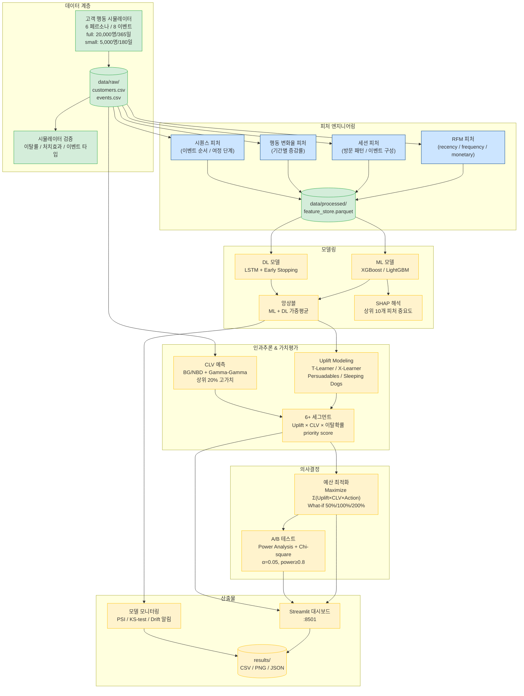

# AI 기반 고객 이탈 예측 및 리텐션 ROI 최적화 시스템

> 이커머스 고객 이탈 예측 + Uplift Modeling 기반 리텐션 ROI 최적화 End-to-End 시스템

[](https://www.python.org/)
[](https://pytorch.org/)
[](https://docs.docker.com/compose/)


## 목차

1. [프로젝트 소개](#프로젝트-소개)
2. [핵심 기능](#핵심-기능)
3. [시스템 아키텍처](#시스템-아키텍처)
4. [기술 스택](#기술-스택)
5. [프로젝트 구조](#프로젝트-구조)
6. [시작하기](#시작하기)
7. [실행 방법](#실행-방법)
8. [환경변수](#환경변수)
9. [데이터 흐름](#데이터-흐름)
10. [산출물 가이드](#산출물-가이드)
11. [보너스 과제](#보너스-과제)
12. [팀 정보](#팀-정보)
13. [마일스톤](#마일스톤)

---

## 프로젝트 소개

### 배경

- 신규 고객 획득 비용은 기존 고객 유지 비용의 **5배** 이상
- 이탈률 5% 감소 → 수익 25% 이상 증가 가능
- 단순 이탈 예측을 넘어, **마케팅 효과가 있는 고객을 식별**하고 제한된 예산 내에서 최적 리텐션 전략을 수립하는 것이 핵심

### 목표

End-to-End 리텐션 시스템 구축:

**시뮬레이터 → 검증 → 피처 엔지니어링 → ML/DL 모델 → Uplift Modeling → CLV 예측 → 예산 최적화 → 통합 대시보드**

### 핵심 CLI 명령어

| 목적 | 명령어 | 주요 산출물 |
|------|--------|-----------|
| 이탈 예측 모델 학습 | `python src/main.py --mode train` | `models/`, `results/shap_summary.png` |
| Uplift 세그먼테이션 | `python src/main.py --mode uplift` | `results/uplift_segments.csv` (4분면) |
| 예산 최적화 | `python src/main.py --mode optimize --budget 50000000` | `results/optimization_result.csv`, ROI 분석 |
| 통합 대시보드 | `docker compose up` | http://localhost:8501 |

### 학습 포인트

- 코호트 분석 / RFM / 행동 변화율 피처 설계
- Uplift Modeling으로 Persuadables / Sleeping Dogs 식별
- CLV × Uplift 기반 마케팅 예산 최적화
- A/B 테스트의 Power Analysis 및 통계적 유의성 검정

---

## 핵심 기능

| 기능 | 세부 요구사항 | 상태 | 담당 |
|------|-------------|------|------|
| 고객 행동 시뮬레이터 | 6 페르소나, 8 이벤트(page_view/search/add_to_cart/remove_from_cart/purchase/coupon_use/review/cs_contact), full: 20,000명/365일 · small: 5,000명/180일, T/C 각 10,000명, 이탈률 15~25% | ✅ 완료 | 형준 |
| 시뮬레이터 검증 | 이탈률 범위(15~25%), T/C 비율(50:50), 8개 이벤트 타입, 행동 감쇠 비율(0.4~0.7), 코호트 멱함수 R²(>0.85) | ✅ 완료 | 형준 |
| 코호트 분석 | M1/M3/M6/M12 리텐션 + Power-law 회귀 | ✅ 완료 | 형준 |
| Docker Compose 인프라 | `docker compose up` 한 번에 7단계(simulator→validator→feature→train/uplift→optimize→dashboard) 순서 실행 | ✅ 완료 | 형준 |
| 피처 엔지니어링 | 30개+ 피처: RFM(12개) + 행동변화율(7개) + 세션(6개) + 시퀀스(5개) + 시간대/여정, 결측·이상치 처리, feature_store.parquet | 🟡 코드 완료 | 현우 |
| ML 이탈 예측 | XGBoost / LightGBM 2종, AUC-ROC 0.78+, 5-Fold CV, SMOTE, SHAP 상위 10개 피처, Optuna 하이퍼파라미터 튜닝 | 🚧 개발 중 | 한솔 |
| DL 시퀀스 모델 | LSTM + 패딩/임베딩 + Early Stopping + ML/DL 앙상블, 동일 test set 비교 | 🚧 개발 중 | 한솔 |
| Uplift Modeling | T-Learner / X-Learner 2종, Qini Curve, 4분면(Persuadables / Sure Things / Lost Causes / Sleeping Dogs) | ✅ 완료 | 한나 |
| CLV 예측 | BG/NBD + Gamma-Gamma, 12개월 기준, 상위 20% 고가치 고객 식별 | ✅ 완료 | 한나 |
| 6+ 세그먼테이션 | 이탈확률 × Uplift × CLV 조합, priority score 산출 | ✅ 완료 | 한나 |
| 예산 최적화 | 목적함수 Maximize Σ(Uplift_i × CLV_i × Action_i), 제약 Σ(Cost_i × Action_i) ≤ Budget, What-if 50%/100%/200% | ✅ 완료 | 한나 |
| A/B 테스트 | Power Analysis(power ≥ 0.8), Chi-square/Z-test, p-value, 95% CI, α=0.05 | ✅ 완료 | 한나 |
| 통합 대시보드 | Streamlit :8501, 이탈현황 / 코호트 / Uplift분포 / CLV / 예산 / A·B / Top-N 우선순위 고객 | 🚧 개발 중 | 지웅 |
| 모델 모니터링 | PSI / KS-test 기반 Drift 감지, 성능 추적, 알림 | 🚧 개발 중 | 지웅 |

---

## 시스템 아키텍처



> 범례: 초록=완료, 파랑=코드 완료(미실행), 노랑=개발 중

---

## 기술 스택

| 카테고리 | 라이브러리 / 버전 |
|---------|-----------------|
| 언어 | Python 3.10+ |
| 데이터 처리 | pandas 2.2, numpy 1.26 |
| ML | XGBoost 2.0, LightGBM 4.3, scikit-learn 1.5 |
| 클래스 불균형 | imbalanced-learn 0.11 (SMOTE) |
| 하이퍼파라미터 최적화 | Optuna 3.4 |
| DL | PyTorch 2.0+ (CPU wheel) |
| Uplift | 자체 구현 (T-Learner / X-Learner, scikit-learn 기반) |
| CLV | lifetimes 0.11 |
| 모델 해석 | SHAP 0.46 |
| 통계 | SciPy 1.13 |
| 시각화 | matplotlib 3.9, seaborn 0.12, plotly 5.24 |
| 대시보드 | Streamlit 1.40 |
| 컨테이너 | Docker, Docker Compose |
| 환경변수 | python-dotenv 1.0 |

---

## 프로젝트 구조

```text
customer-churn-retention-system/
├── config/
│   ├── simulator_config.yaml      # 시뮬레이터 설정 (페르소나 / 마케팅 / 시즌)
│   └── model_config.yaml          # 모델 하이퍼파라미터 / 경로 / SHAP 설정
├── data/
│   ├── raw/                       # 시뮬레이터 출력 (customers.csv, events.csv)
│   └── processed/                 # 피처 엔지니어링 결과 (feature_store.parquet)
├── src/
│   ├── main.py                    # 진입점 — 5가지 모드 (simulate/feature/train/uplift/optimize)
│   ├── main_train.py              # ML/DL/앙상블 학습 파이프라인
│   ├── data/
│   │   ├── simulator.py           # 고객 행동 시뮬레이터
│   │   └── validate_simulator.py  # 시뮬레이터 검증 (이탈률/T-C/이벤트)
│   ├── features/
│   │   ├── rfm.py                 # RFM + 행동 변화율 피처
│   │   ├── session.py             # 세션 / 시간대 피처
│   │   ├── sequence.py            # 시퀀스 / 여정 단계 피처
│   │   ├── store.py               # 피처 스토어 통합 (결측·이상치 처리)
│   │   └── validate_pipeline.py   # 피처 파이프라인 검증
│   ├── models/
│   │   ├── ml_trainer.py          # XGBoost / LightGBM 학습
│   │   ├── dl_trainer.py          # LSTM 학습
│   │   ├── ensemble.py            # ML+DL 앙상블
│   │   ├── shap_analyzer.py       # SHAP 해석
│   │   ├── clv_predictor.py       # CLV (BG/NBD)
│   │   ├── uplift.py              # Uplift 모델
│   │   ├── optuna_tuner.py        # Optuna 튜닝
│   │   ├── threshold_analyzer.py  # Threshold 분석
│   │   ├── data_loader.py         # 데이터 로더
│   │   └── config_loader.py       # 설정 로더
│   ├── uplift/
│   │   └── segmentation.py        # 6+ 세그먼트 분류
│   ├── optimization/
│   │   └── budget.py              # 예산 최적화 (그리디 + What-if)
│   ├── analysis/
│   │   ├── cohort.py              # 코호트 리텐션 분석
│   │   ├── churn_pattern.py       # 이탈 패턴 분석
│   │   └── ab_test.py             # A/B 테스트 검정
│   ├── monitoring/                # 🚧 PSI / KS-test 모니터링
│   └── dashboard/
│       └── app.py                 # 🚧 Streamlit 대시보드
├── docs/
│   ├── feature_dictionary.md      # 피처 정의서 (30개+)
│   ├── uplift_analysis.md         # Uplift 분석 결과
│   ├── retention_strategy.md      # 6세그먼트 리텐션 전략
│   ├── ab_test_report.md          # Power 분석 + p-value 검정 결과
│   └── model_report.md            # 🚧 ML/DL 비교 리포트
├── results/                       # 분석 산출물 (CSV / PNG / JSON)
├── models/                        # 학습된 모델 파일
├── docker-compose.yml
├── Dockerfile
├── requirements.txt
├── .env.example
└── README.md
```

---

## 시작하기

### 사전 요구사항

- Docker 24+ / Docker Compose 2+
- (로컬 개발 시) Python 3.10+, Git

### 방법 1: Docker (권장)

```bash
# 1. 저장소 클론
git clone https://github.com/neibler/customer-churn-retention-system.git
cd customer-churn-retention-system

# 2. 환경변수 설정
cp .env.example .env
# 필요시 .env 편집

# 3. 전체 파이프라인 실행 (simulator → feature → train/uplift → optimize → dashboard)
docker compose up --build
```

대시보드: http://localhost:8501

> `docker compose up` 한 번으로 7개 서비스가 의존 순서대로 자동 실행됩니다.
> 대시보드는 train + optimize 완료 후 자동으로 시작됩니다.

### 방법 2: 로컬 개발

```bash
# 1. 가상환경
python -m venv .venv
source .venv/bin/activate   # Linux/Mac
.venv\Scripts\activate      # Windows

# 2. 의존성 설치 (PyTorch는 CPU 버전 별도 설치)
pip install torch --index-url https://download.pytorch.org/whl/cpu
pip install -r requirements.txt

# 3. 환경변수 설정
cp .env.example .env

# 4. 시뮬레이션 실행 (small 모드로 빠르게 검증)
python src/main.py --mode simulate --sim-mode small
```

---

## 실행 방법

### 1) 시뮬레이션 ✅ 완료

```bash
# Small 모드: 5,000명 / 180일 (개발 / 테스트용)
python src/main.py --mode simulate --sim-mode small

# Full 모드: 20,000명 / 365일 (운영용)
python src/main.py --mode simulate --sim-mode full
```

**산출물:** `data/raw/customers.csv`, `data/raw/events.csv`

| 파라미터 | small | full |
|---------|-------|------|
| 고객 수 | 5,000명 | 20,000명 |
| 기간 | 180일 (6개월) | 365일 (12개월) |
| 처치/대조군 | 각 50% (2,500명) | 각 50% (10,000명) |
| 목표 이탈률 | 15~25% | 15~25% |
| 페르소나 | 6종 | 6종 |
| 이벤트 타입 | 8종 | 8종 |

### 2) 피처 엔지니어링 🟡 코드 완료

```bash
python src/main.py --mode feature
```

**내부 동작:** RFM + 행동변화율 + 세션 + 시퀀스 + 여정 피처 산출 → 결측·이상치 처리 → 검증

**산출물:** `data/processed/feature_store.parquet`, `results/feature_validation_report.json`

| 피처 그룹 | 개수 | 대표 피처 |
|---------|------|---------|
| RFM | 12개 | recency_days, frequency, monetary, rfm_score |
| 행동 변화율 | 7개 | visit_change_rate, session_duration_change_rate 등 |
| 세션 | 6개 | avg_session_length, bounce_rate, search_to_purchase_rate |
| 시퀀스/여정 | 5개+ | seq_entropy, journey_stage_id, behavior_cluster_id |
| 시간대 | 7개 | weekend_purchase_ratio, month_end_activity_ratio 등 |

### 3) 이탈 예측 모델 학습 🚧 개발 중

```bash
python src/main.py --mode train
```

> feature_store.parquet이 없으면 자동으로 --mode feature를 먼저 실행합니다.

**예정 산출물:** `models/xgboost_v1.joblib`, `models/lightgbm_v1.joblib`, `models/lstm_v1.pt`, `results/shap_summary.png`, `results/model_summary.json`

| 요구사항 | 목표값 |
|---------|-------|
| AUC-ROC | 0.78+ |
| CV | 5-Fold Stratified |
| 클래스 불균형 | SMOTE |
| 튜닝 | Optuna (n_trials=50) |
| 앙상블 | ML best + LSTM 가중평균 |

### 4) Uplift 세그먼테이션 ✅ 완료

```bash
python src/main.py --mode uplift
```

**산출물:** `results/uplift_segments.csv`, `results/qini_curve.png`, `results/clv_predictions.csv`, `results/segments_6plus.csv`

| 세그먼트 | 설명 | 액션 |
|---------|------|------|
| Persuadables | 마케팅 효과 ↑, 이탈 위험 ↑ | 적극 개입 |
| Sure Things | 마케팅 없어도 잔류 | 비용 절감 |
| Lost Causes | 마케팅 효과 없음 | 제외 |
| Sleeping Dogs | 마케팅 시 오히려 이탈 | 개입 금지 |

### 5) 예산 최적화 ✅ 완료

```bash
python src/main.py --mode optimize --budget 50000000
```

**목적함수:** Maximize Σ(Uplift_i × CLV_i × Action_i)
**제약조건:** Σ(Cost_i × Action_i) ≤ Budget

**산출물:** `results/optimization_result.csv`, `results/whatif_analysis.csv`, `results/budget_allocation.png`

### 6) 통합 대시보드 🚧 개발 중

```bash
# Docker (전체 파이프라인과 함께 자동 실행)
docker compose up

# 로컬 단독 실행
streamlit run src/dashboard/app.py
```

**브라우저:** http://localhost:8501

**대시보드 패널:**
- 이탈 위험 현황 (Total / At Risk / AUC)
- 코호트 리텐션 분석 (M1/M3/M6/M12)
- Uplift 세그먼트 분포
- 예산 최적화 시뮬레이션 (ROI)
- 리텐션 대상 고객 Top-N (우선순위순)
- A/B 테스트 결과 요약

---

## 환경변수

`.env` 파일로 관리. 시작 시 `.env.example`을 복사:

```bash
cp .env.example .env
```

| 변수 | 설명 | 가능한 값 | 기본값 |
|------|------|-----------|--------|
| `APP_MODE` | 실행 모드 | `simulate` / `feature` / `train` / `uplift` / `optimize` | `simulate` |
| `SIM_MODE` | 시뮬레이션 규모 | `full` / `small` | `full` |
| `BUDGET` | 마케팅 예산 (KRW) | 숫자 (예: `50000000`) | 미설정 (기본 5천만원) |

**우선순위:** CLI 인수 > `.env` 환경변수 > 하드코딩 기본값

```bash
# 예시: .env에 SIM_MODE=small이 있어도 CLI가 우선
python src/main.py --mode simulate --sim-mode full
```

---

## 데이터 흐름

### Docker Compose 파이프라인 (자동 순서)

```text
[simulator] python src/main.py --mode simulate
    │
    ├──► [validator] python src/data/validate_simulator.py   (병렬)
    │        검증: 이탈률 15~25% / T-C 50:50 / 8개 이벤트 타입
    │
    └──► [feature]  python src/main.py --mode feature
             │
             ▼  data/processed/feature_store.parquet
         [train]   python src/main.py --mode train ─────────────┐
                                                                 ▼
         [uplift]  python src/main.py --mode uplift           [dashboard]
             │     results/uplift_segments.csv                   :8501
             ▼
         [optimize] python src/main.py --mode optimize ──────────┘
                    results/optimization_result.csv
```

### 데이터 흐름 (파일 기준)

```text
[시뮬레이터]                              ← config/simulator_config.yaml
    │
    ▼  data/raw/{customers,events}.csv
[피처 엔지니어링]                          ← config/model_config.yaml
    │
    ▼  data/processed/feature_store.parquet
[ML/DL 모델 학습]
    │
    ▼  models/{xgboost,lightgbm}_v1.joblib, models/lstm_v1.pt
[Uplift Modeling / CLV / 세그먼테이션]
    │
    ▼  results/{uplift_segments,clv_predictions,segments_6plus}.csv
[예산 최적화 + A/B 테스트]
    │
    ▼  results/{optimization_result,whatif_analysis}.csv
[Streamlit 대시보드 :8501]
```

---

## 산출물 가이드

### 필수 산출물 9종

| 경로 | 설명 | 상태 |
|------|------|------|
| `docs/feature_dictionary.md` | 피처 정의서 (30개+ 피처 명세) | ✅ |
| `docs/model_report.md` | ML/DL/앙상블 비교 리포트 | 🚧 |
| `docs/retention_strategy.md` | 6세그먼트 리텐션 전략 + 목적함수 수식 | ✅ |
| `docs/ab_test_report.md` | Power 분석 + p-value 검정 결과 | ✅ |
| `docs/uplift_analysis.md` | Qini Curve + 4분면 분석 해설 | ✅ |
| `results/clv_predictions.csv` | 고객별 CLV 예측값 (12개월, 상위 20%) | ✅ |
| `results/segments_6plus.csv` | 6+ 세그먼트 최종 분류 + priority score | ✅ |
| `results/monitoring_report.json` | PSI / KS-test 결과 + 임계치 | 🚧 |
| `results/shap_summary.png` | SHAP 상위 10개 피처 중요도 | 🚧 |

### 전체 산출물

| 경로 | 설명 | 상태 |
|------|------|------|
| `data/raw/customers.csv` | 고객 마스터 (6 페르소나 / 처치여부 / 이탈여부) | ✅ |
| `data/raw/events.csv` | 이벤트 로그 (8 이벤트 타입 / 날짜 / 주문금액) | ✅ |
| `data/processed/feature_store.parquet` | 통합 피처 스토어 (30개+ 피처) | 🟡 |
| `results/feature_validation_report.json` | 피처 파이프라인 검증 리포트 | ✅ |
| `models/xgboost_v1.joblib` | 학습된 XGBoost 모델 | 🚧 |
| `models/lightgbm_v1.joblib` | 학습된 LightGBM 모델 | 🚧 |
| `models/lstm_v1.pt` | 학습된 LSTM 모델 | 🚧 |
| `results/shap_summary.png` | SHAP 상위 10개 피처 중요도 | 🚧 |
| `results/cohort_retention.png` | 코호트 리텐션 곡선 (M1~M12) | ✅ |
| `results/uplift_segments.csv` | Uplift 세그먼트 분류 결과 (4분면) | ✅ |
| `results/clv_predictions.csv` | 고객별 CLV 예측값 | ✅ |
| `results/segments_6plus.csv` | 6+ 세그먼트 최종 분류 | ✅ |
| `results/qini_curve.png` | Qini Curve (Uplift 성능 시각화) | ✅ |
| `results/optimization_result.csv` | 고객별 예산 배분 + 예상 ROI | ✅ |
| `results/whatif_analysis.csv` | 예산 시나리오별 What-if 분석 | ✅ |
| `results/budget_allocation.png` | 예산 배분 시각화 (3개 차트) | ✅ |
| `results/ab_test_result.json` | A/B 테스트 검정 결과 | ✅ |
| `results/v2_validation_report.md` | 시뮬레이터 v2 검증 리포트 | ✅ |
| `results/monitoring_report.json` | 모델 드리프트 모니터링 리포트 | 🚧 |
| `docs/feature_dictionary.md` | 피처 정의서 | ✅ |
| `docs/uplift_analysis.md` | Uplift 분석 해설 | ✅ |
| `docs/retention_strategy.md` | 6세그먼트 리텐션 전략 | ✅ |
| `docs/ab_test_report.md` | A/B 테스트 분석 리포트 | ✅ |
| `docs/model_report.md` | ML/DL 비교 리포트 | 🚧 |

> 🟡 = 코드 완료 (실행 시 생성). data/processed/는 .gitignore 대상.

---

## 보너스 과제

| # | 과제 | 설명 | 상태 |
|---|------|------|------|
| 보너스 1 | 실시간 이탈 스코어링 | Kafka / Redis Streams 기반 스트리밍 파이프라인 | 📋 예정 |
| 보너스 2 | Survival Analysis | Cox Proportional Hazard 또는 Survival Random Forest 기반 이탈 시점 예측 | 📋 예정 |
| 보너스 3 | 개인화 추천 연동 | 이탈 위험 고객 대상 맞춤 상품 추천 모듈 | 📋 예정 |
| 보너스 4 | MLflow 실험 관리 | 하이퍼파라미터 / 모델 버전 / 실험 결과 추적 | 📋 예정 |

---

## 팀 정보

**팀명:** 두쫀쿠 (5인)

| 이름 | 역할 |
|------|------|
| **조형준** (팀장) | 시뮬레이터 / 인프라 / 총괄 |
| 장현우 | 피처 엔지니어링 / 코호트 분석 |
| 배한솔 | ML / DL 모델링 |
| 배한나 | Uplift / CLV / 예산 최적화 / A/B 테스팅 |
| 김지웅 | 대시보드 / 모니터링 / 문서화 / 발표 |

---

## 마일스톤

| 일정 | 마일스톤 | 상태 |
|------|---------|------|
| 2026-04-13 | 제안 발표 | ✅ 완료 |
| 2026-04-14 ~ 04-27 | 시험 기간 (개발 중단) | — |
| 2026-05-19 | 중간 보고 | ✅ 완료 |
| 2026-06-15 | 최종 보고 | 📋 예정 |

---

## 라이선스

본 프로젝트는 학술 캡스톤 프로젝트입니다. 외부 사용 라이선스는 부여되지 않았습니다.

---

**Last Updated:** 2026-05-27
